# Hardware Setup Guide
## Platform Overview
"The Crazyflie 2.1 is a versatile open source flying development platform that only weighs 29g and fits in the palm of your hand"

"Together with an extensive ecosystem of software and deck expansions it’s ideal for education, research and swarming"

*https://www.bitcraze.io/products/old-products/crazyflie-2-1/*

The hardware platform is composed of the base Crazyflie 2.1, as well as three additional external expansion decks offered by Bitcraze. The list below provides the minimum hardware required to enable all of the functionality described in this project.

## Parts List
- (Qty. 1+) Crazyflie 2.1 Kit
- (Qty. 1+) Flow Deck v2
- (Qty. 1+) SD Card Deck
- (Qty. 1+) Micro SD card (any brand)
- (Qty. 1+) AI Deck
- (Qty. 1) Crazyradio PA dongle
- (Qty. 1) Micro USB Cable

*https://store.bitcraze.io/collections/all?page=1*

## Setting up the Drone
### Building the base drone
To begin, we start by assembling the base Crazyflie 2.1 from the parts kit. This guide will not go into detail on how to do a first-time assembly of the Crazyflie 2.1. Instead, please reference the [official Bitcraze Guide](https://www.bitcraze.io/documentation/tutorials/getting-started-with-crazyflie-2-x/).

Your assembled base drone should look more or less like the drone pictured below.

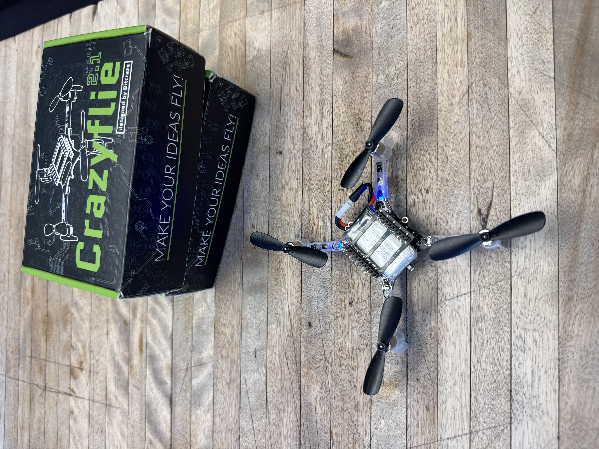

Note that you will need to use the longer expansion headers.

### Attaching the Expansion Decks
The next step after assembling the base Crazyflie 2.1 is to attach the required expansion decks.

Start by pushing the headers from the top to add some slack at the bottom of the drone for an expansion deck. You will need approximately 5-8 mm of slack at the bottom. 

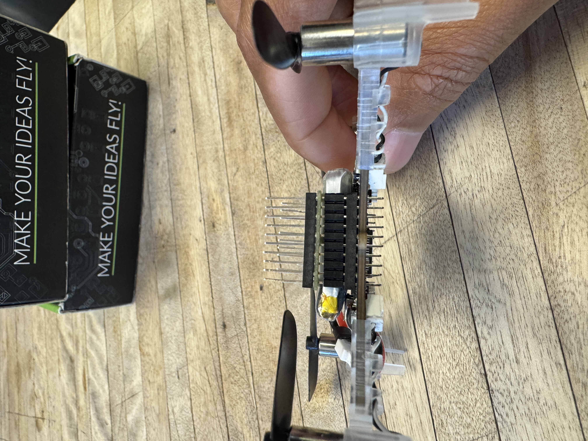

Note that the expansion headers are delicate so be careful and try to apply force slowly and evenly until the headers move.

Next, attach the Flow Deck v2 to the bottom of the drone via the expansion headers. 

Make sure the flow deck is properly aligned with the symbol on the bottom of the drone.

| 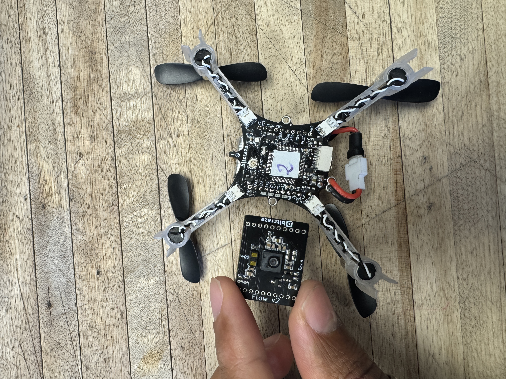 | 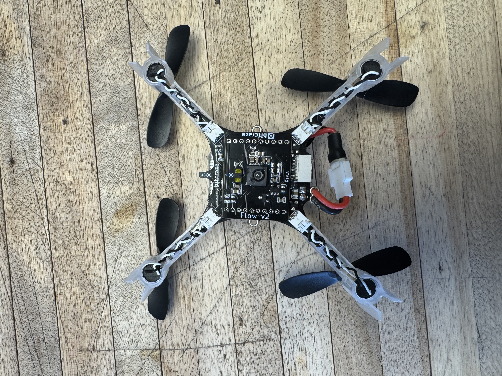 |
|--------------------------|--------------------------|

Next, take the micro SD card and place it in the SD Card Deck.

| 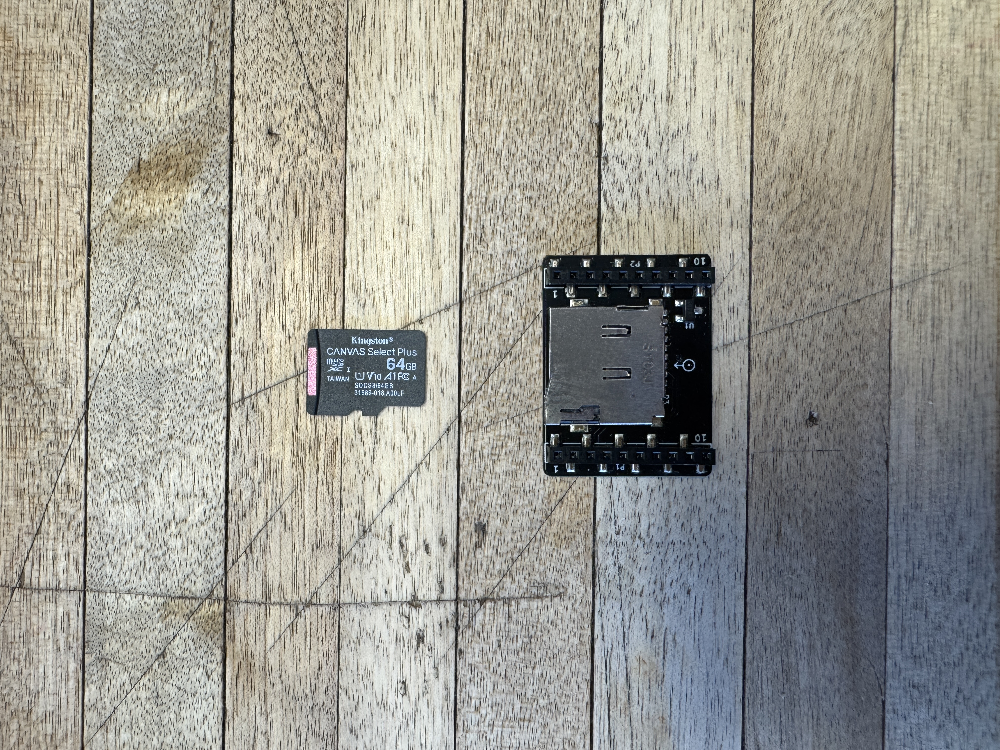 | 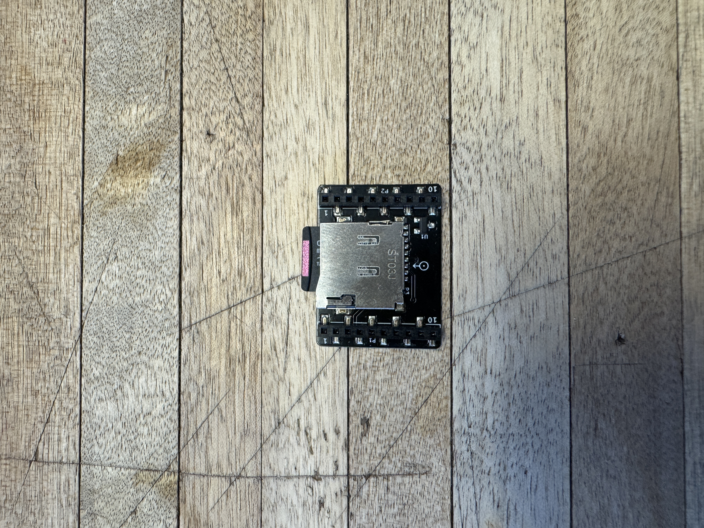 |
|--------------------------|--------------------------|

Attach the sd card deck to the top of the drone, making sure the arrow on the top of the sd card deck is pointing in the opposite direction of the micro usb port.

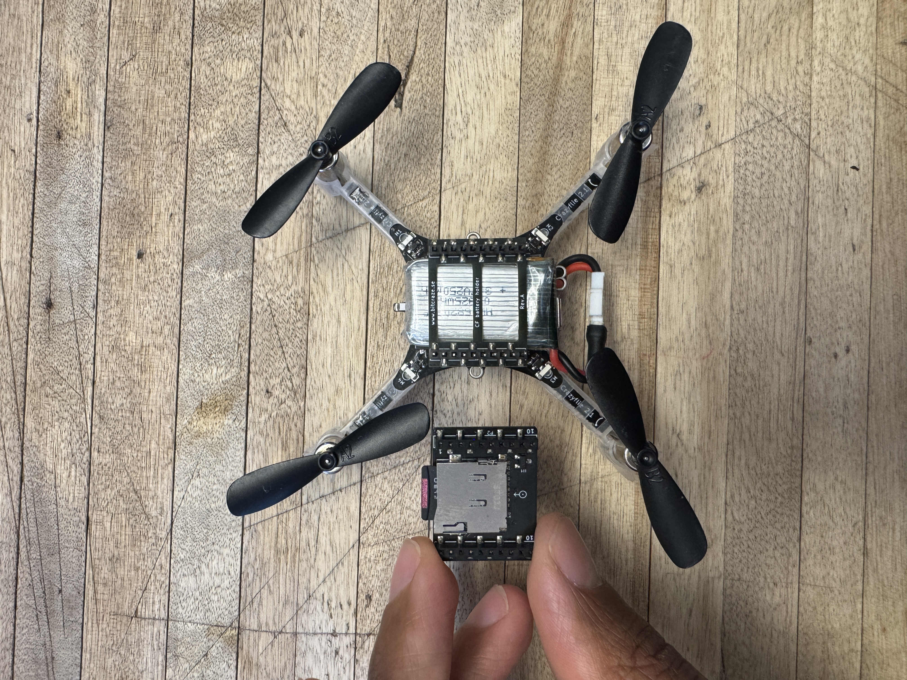

The next step is a workaround to get the Flow deck, SD Card deck, and AI deck all working at the same time. The SD Card deck uses the main SPI bus to access the filesystem on the micro sd card. This SPI bus is also used by the Flow deck to access the registers on the Optical Flow sensor. As a result, we must share the SPI bus between the two slaves by defining a different CS pin for each respective device.

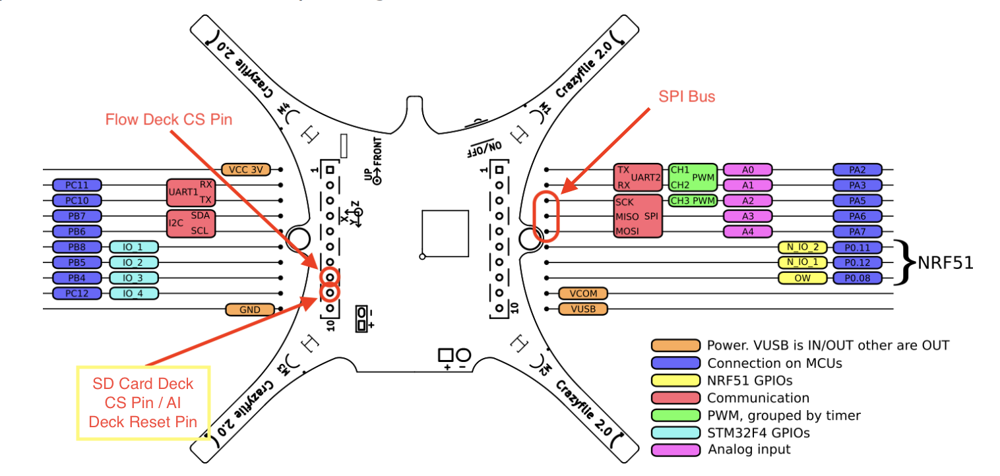

Unfortunately, the default CS pin used by the SD Card deck is also used by the AI deck as a reset pin. To get around this, we can simply remove the connection to the AI deck reset pin as the STM32 to AI deck reset command functionality has not been added to ArduPilot anyways.

To do this, you can simply remove the long pin shown below from the expansion header and replace it with a smaller one.

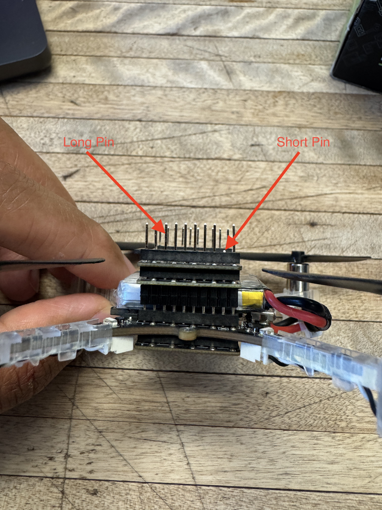

Finally, attach the AI Deck to the top of the drone. Ensure the camera module is facing the opposite direction of the micro usb port.

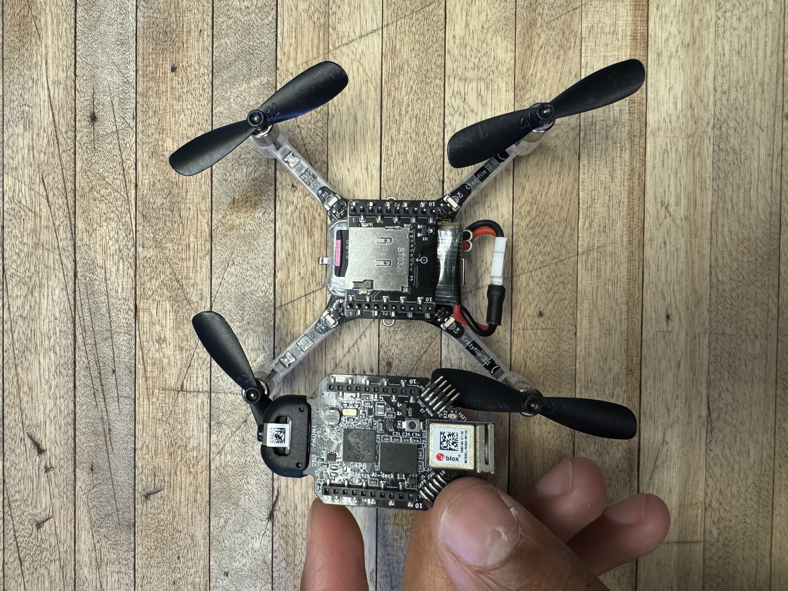

Note: ensure the reset pin discussed previously is not making contact with the AI deck as the SD card deck's CS pin will interfere with the operation of the AI deck.

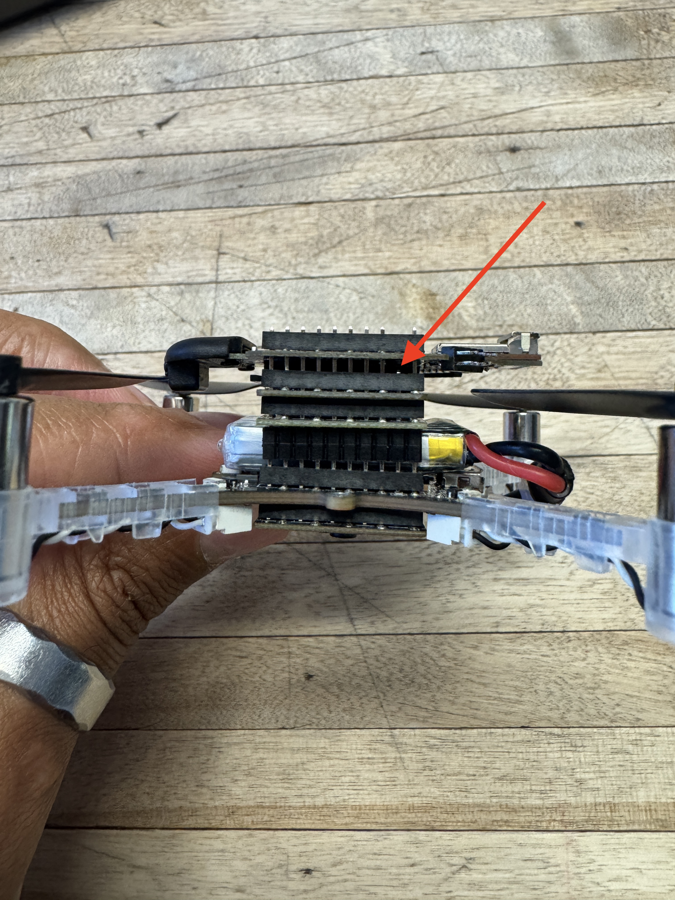

Your Crazyflie 2.1 hardware should now be ready to begin software setup and later flight testing. All drones used for swarming applications should follow the same setup process.

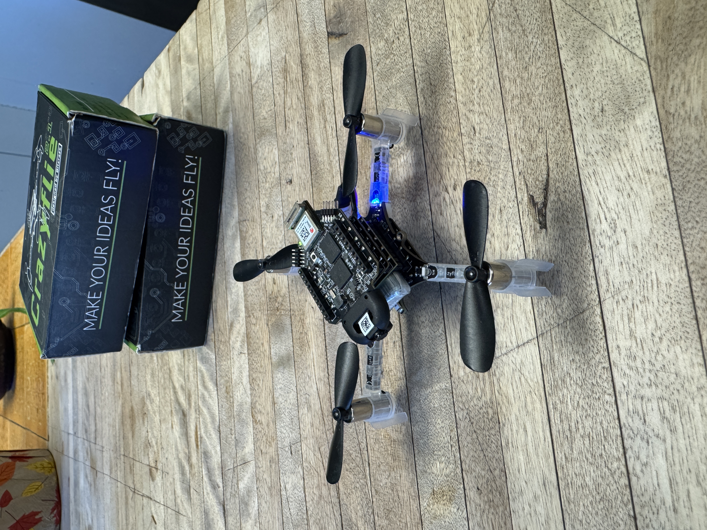