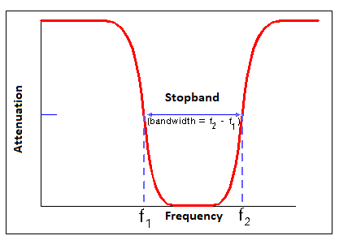
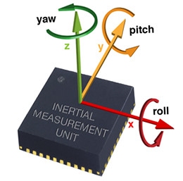
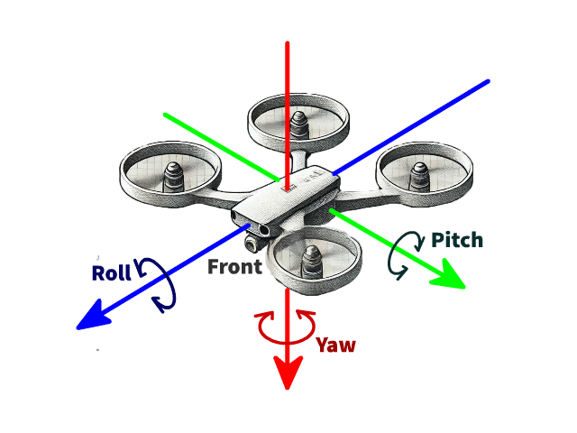
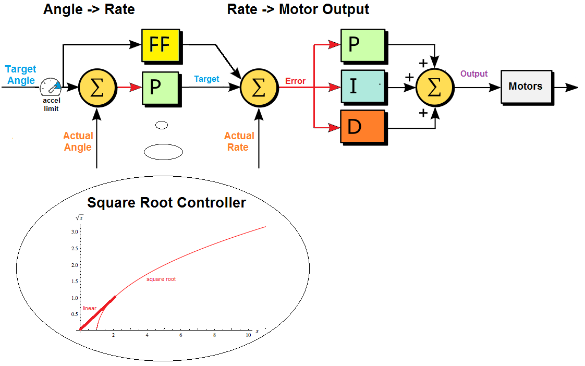
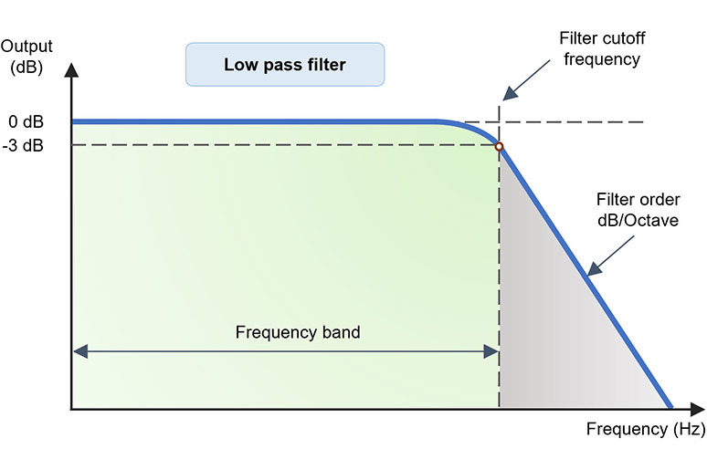
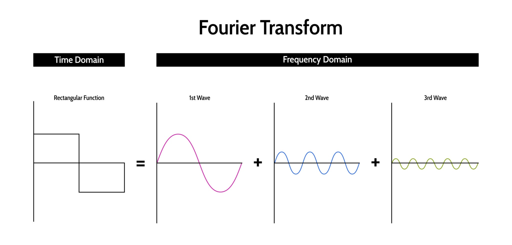
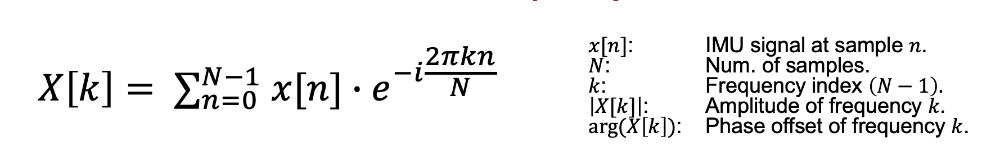
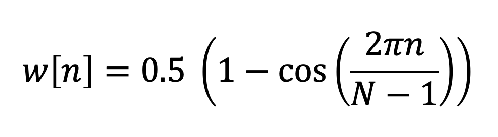
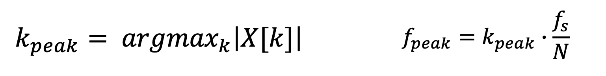

# Notch Filtering Setup
## What is Notch Filtering?
A Notch Filter is a filter that rejects/attenuates signals in a specific frequency band called the stop band frequency range, and passes the signals above and below this band. 

For example, if a Notch Filter has a stop band frequency from 1500 MHz to 1550 MHz, it will pass all signals from DC to 1500 MHz and above 1550 MHz. It will only block those signals from 1500 MHz to 1550 MHz.



## Use Case

Aerial drones like the Crazyflie use IMUs (Inertial Measurement Units) to estimate the kinematic state of the drone. Specifically, a drone's IMU generally contains a 3-axis gyroscope which measures the angular rotation of the drone along the yaw, pitch and roll axis. 

|  |  |
|--------------------------|--------------------------|

These measurements are then fed into a state estimation algorithm which provides current angle and rate estimates. These state estimates are critical in the foundational stability controllers of the drone. They are fed into the low-level stability PID controllers.



Naturally, any inaccuracy of the measurements provided by the IMU effects the performance of the PID controllers which can effect the performance of the drone and even cause instability leading to a catastrophic failure.

One of the primary sources for inaccuracies in IMU measurements is the vibration which results from the spinning motors. On larger drones, the effect of these vibrations can be minimized by using physical dampers. However, on micro drones such as the Crazyflie we rely entirely on software filtering to handle motor vibrations and other disturbances affecting the IMU.

One of the most effective filtering techniques we can use is also the simplest. A low-pass filter can be applied which reduces vibrations by attenuating high frequency signals (ex. motor vibrations) and letting low frequency signals (actual movement of drone) pass. The domain of low pass filters can be set by altering the cutoff frequency.



The issue with low pass filters however, is that they introduce phase lag, which essentially delays the response of a controller, forcing a more conservative (and less performant) PID tune.

## Theory Background
As mentioned previously, a drone's motors are the primary source of high-frequency vibrations. These vibrations are not random; they occur at specific frequencies directly related to the motor's RPM (Rotations Per Minute).

As a result, we need a method to identify the frequencies of the unwanted vibrations. With these target frequencies, we can then use notch filters to eliminate narrow, specific bands of frequencies while leaving all other frequencies untouched.

The method we use is called the FFT (Fast Fourier Transform). The FFT is an applied algorithm which makes use of the Fourier Transform, which takes a complex signal that changes over time and deconstructs it into the individual frequencies that make it up, showing you how strong each frequency is.

- Input: A complex signal in the time domain.
- Output: The same signal represented in the frequency domain.



For our purposes, we use a variant of the Fourier Transform called the DFT (Discrete Fourier Transform) which operates over a discrete domain rather than a continuos domain as the name suggests. This allows us to apply it to the discrete measurements provided by the IMU.



The output, $X[k]$, is a complex number that tells us two things about the frequency $f_k$ in the original signal:

- Magnitude: $|X[k]|$ represents the amplitude or "strength" of that frequency component. This is what we're most interested in for vibration analysis.

- Phase: $\arg(X[k])$ represents the phase offset of that frequency component.

The DFT assumes the signal segment of length $N$ is perfectly periodic. In reality, our IMU signal is not. Taking a finite chunk of it creates artificial discontinuities at the start and end of the window. These sharp edges introduce spurious frequencies into our spectrum, which is called spectral leakage.

To mitigate this, we apply a windowing function, $w[n]$, to the signal before performing the FFT. The actual input to the FFT is thus $x[n] \cdot w[n]$ instead of $x[n]$.

This window function is a shape that is zero at the ends and has a peak in the middle. It smoothly tapers the signal down at the boundaries, reducing the artificial discontinuities. An example of a window function is the Hann window:



At this point, for a given slice of time, the tool has calculated the magnitude spectrum, $|X[k]|$, for each IMU axis (yaw, pitch, roll). This spectrum shows the magnitude of all frequencies present in that moment.

The algorithm can now scan through the magnitude spectrum to find the frequency bin, $k_{peak}$, that has the maximum amplitude. This corresponds to the dominant vibrational frequency in that window of time.



These peaks can now be targeted by the notch filters, attenuating the unwanted vibration based disturbances while minimizing performance-reducing phase delay.

## Enabling Notch Filtering
To enable notch filtering in ArduPilot on the Crazyflie 2.1 drones, we need to make a few changes to the base ArduPilot firmware.

Due to the lightweight construction of the Crazyflie drones, we need to enable certain features that have been disabled by default to save flash storage space. This is because the main MCU on the Crazyflie (STM32) has limited onboard flash of 1 Mb which is less than the minimum 2 Mb required for the full build of ArduPilot.

### Modify the HWDEF file
Start by enabling the notch filtering in the hardware definition file:

- In your development environment, navigate to the Crazyflie hwdef file:
```
path\...\libraries\AP_HAL_ChibiOS\hwdef\crazyflie2\hwdef.dat
```
- Near the bottom of the file, find the line that minimizes the ArduPilot features:
```
include ../include/minimize_features.inc
```
- Below this line, include the following lines: 
```
undef HAL_GYROFFT_ENABLED             #Notch Filtering Support
define HAL_GYROFFT_ENABLED 1
```
This tells the compiler to include the notch filtering library in our ArduPilot build regardless of the minimize features directive.

## Compiling & Flashing to the Crazyflie
Before using notch filtering in ArduPilot, we need to compile the custom firmware and flash it to the Crazyflie.

For detailed flashing instructions, please reference the [Compiling & Flashing Guide](compiling_and_flashing.md).

As mentioned previously, notch filtering is not intended for lightweight MCU’s such as the STM32 found on the Crazyflie.

If you attempt to compile your firmware and get a build failed error:
```
Build failed -> task in 'bin/arducopter' failed (exit status 1)
```
Chances are you have exceeded the memory limit. Please reference the [Freeing up Memory Guide](freeing_up_memory.md) for detailed instructions on how to reduce the build size.

## Testing and Using Notch Filtering
Once you have successfully flashed your custom firmware with notch filtering enabled, start by changing the new parameter FFT_ENABLE from 0 to 1 upon startup of your drone.

After changing the parameter value and saving it to memory, restart the system by either cutting power to the drone directly or sending a reboot command through MAVLink.

Once the system has restarted, several new FFT parameters should now be available.

Notch filtering is now enabled on your Crazyflie drone. If you would like to tune the filter yourself, reference the [official ArduPilot FFT-Based Notch Filtering Guide](https://ardupilot.org/copter/docs/common-imu-fft.html).

Otherwise, reference the [Pre-Flight Checklist](pre_flight_checklist.md) for the default ArduSwarm parameters.